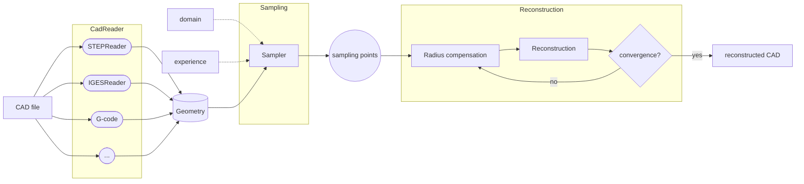
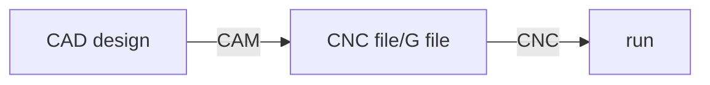

# cm4omi

> 基于CAD模型的在机自由曲面检测

OMI process

## CADReader

### Intro

> 用于读取不同类型的 CAD 文件，获取其几何信息，用于后面的采样和重构模块的几何信息来源

### STEPCODE or OCC

### references

**数控机床加工流程：**

**常用CAD文件类型：**

> refs：
>
> + [CNC 加工的 CAD 文件格式有哪些？](https://baijiahao.baidu.com/s?id=1707060572098130226)

+ STEP/STP：**AP203  AP214  AP242**
+ IGES

## Sampling

### Intro

> 根据读取的 CAD 模型的曲面特征，来设计采样点相对于 CAD 模型的位置

## Reconstruction

### Intro

> 根据 CAD 模型读取的特征 、 接触式探头的信息 和 接触式探头的测量结果  得到 重构结果

