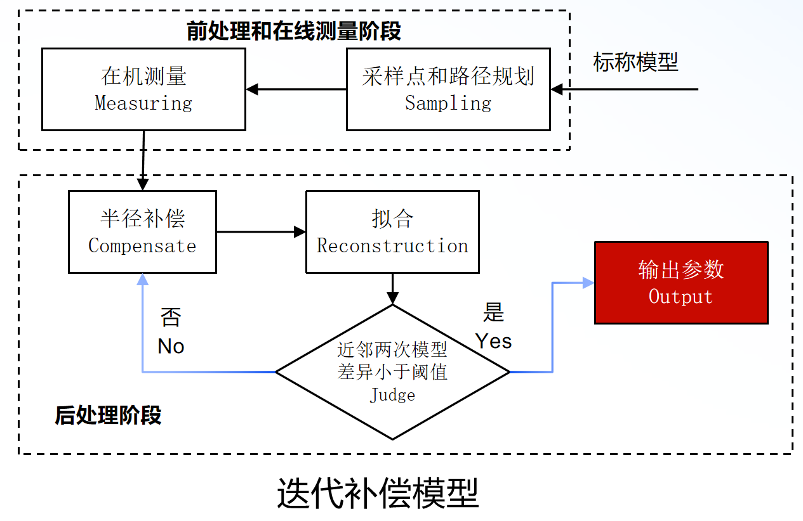
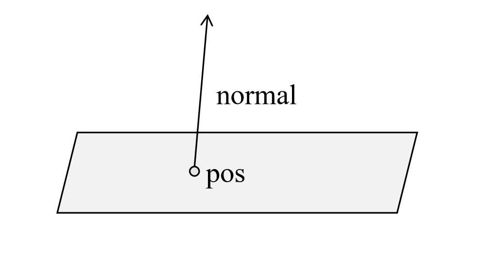
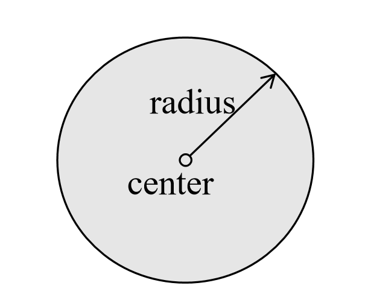
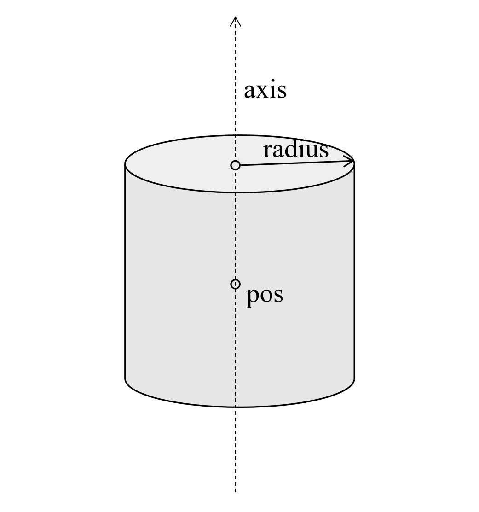
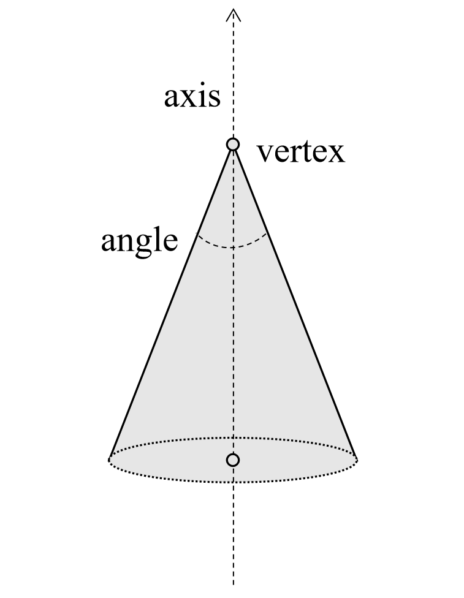

## 在机测量拟合算法

### 1. 拟合算法说明

### 2. 运行环境与配置说明

#### （1）运行环境

在机测量拟合算法的运行环境如表1所示。

| 编程语言   | C++                |
| ---------- | ------------------ |
| 编译器版本 | Visual Studio 2022 |

#### （2）配置说明

主函数在LIB_USE_TEST中，原来测试其他模块生成的dll。

目前有3个模块文件有效：

1. Model：模型库，用于构造模型
2. SpaceMath：空间几何数学库
3. Reconstruction：迭代拟合库

### 3. 函数说明

#### （1）最小二乘法类：leastsq

​	这个类的方法不需要我们直接调用，被迭代拟合类中的拟合函数 fit 调用。

#### （2）迭代拟合类：reconstructor

1. 构造方法：`reconstructor(Model* model, std::vector<std::vector<double>> data);`

   ​	输入形参1：model，类型：Model类，含义：用来指导拟合的残差函数选择和初始化拟合参数。

   ​	输入形参2：data，类型：std::vector\<std::vector\<double\>\>，长度：拟合点数组的长度，含义：拟合点数组。

2. 拟合方法：`std::vector<double> fit(double tol=1e-4, int maxIter=10);`

   ​	输入形参1：tol，类型：double，含义：用来指导迭代拟合的收敛精度，数值越小拟合越趋近于收敛。

   ​	输入形参2：maxIter，类型：int，含义：指导迭代的最高次数，默认为10次。

   ​	输出：thetas：类型：std::vector\<double\>，长度：拟合的模型类型的参数个数，含义：输出的为迭代收敛拟合后的参数数组。

#### （3）平面半径补偿函数：planeComp

​	函数原型：`std::vector<std::vector<double>> reconstructor::planeComp(std::vector<double> iter_thetas)`

​	输入形参1：iter_thetas，类型：std::vector\<double\>，长度：平面的参数个数6，含义：6个参数按顺序分别是平面法向，平面上任一点.

​	输出：res，类型：std::vector\<std::vector\<double\>\>，长度：跟构造 reconstructor 类时输入的data点集的维度相同，含义：以投影在平面上的点为指导半径补偿方向，输出半径补偿后的拟合点数组。

#### （4）球体半径补偿函数：sphereComp

​	函数原型：`std::vector<std::vector<double>> reconstructor::sphereComp(std::vector<double> iter_thetas)`

​	输入形参1：iter_thetas，类型：std::vector\<double\>，长度：球体的参数个数4，含义：4个参数按顺序分别是球体球心位置，球体的半径。

​	输出：res，类型：std::vector\<std::vector\<double\>\>，长度：跟构造 reconstructor 类时输入的data点集的维度相同，含义：以球心方向为指导半径补偿方向，输出半径补偿后的拟合点数组。

#### （5）柱体半径补偿函数：cylinderComp

​	函数原型：`std::vector<std::vector<double>> reconstructor::cylinderComp(std::vector<double> iter_thetas)`

​	输入形参1：iter_thetas，类型：std::vector\<double\>，长度：柱体的参数个数7，含义：7个参数按顺序分别是柱体的轴上一点pos，柱体的轴向axis，柱体的半径。

​	输出：res，类型：std::vector\<std::vector\<double\>\>，长度：跟构造 reconstructor 类时输入的data点集的维度相同，含义：以点在柱体轴上投影点为指导半径补偿方向，输出半径补偿后的拟合点数组。

#### （6）锥体半径补偿函数：coneComp

​	函数原型：`std::vector<std::vector<double>> reconstructor::coneComp(std::vector<double> iter_thetas)`

​	输入形参1：iter_thetas，类型：std::vector\<double\>，长度：锥体的参数个数7，含义：7个参数按顺序分别是锥点vertex，锥体的轴向axis，锥体的顶角(弧度表示)。

​	输出：res，类型：std::vector\<std::vector\<double\>\>，长度：跟构造 reconstructor 类时输入的data点集的维度相同，含义：以垂直于圆锥母线为指导半径补偿方向，输出半径补偿后的拟合点数组。

### 4.模型参数说明

#### （1）Plane

> `normal`：平面法向量；
>
> `pos`：平面上任一点，用于协助法向量定位平面的位置；

#### （2）Sphere

> `center`：球体球心坐标；
>
> `radius`：球体半径

#### （3）Cylinder

> `pos`：柱体轴线上任一点，用于配合柱体轴线来确定柱体位置；
>
> `axis`：柱体的轴向方向向量；
>
> `radius`：柱体半径

#### （4）Cone

> `vertex`：圆锥的顶点坐标；
>
> `axis`：圆锥的轴向方向，默认朝向顶点
>
> `angle`：圆锥顶角大小（弧度单位）

